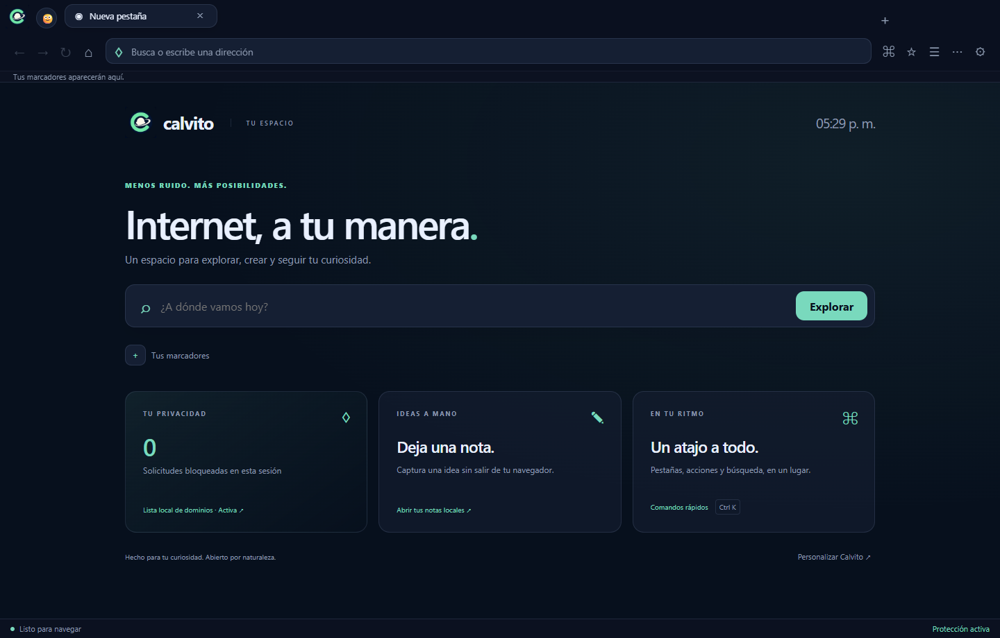

<p align="center"></p>

# Calvito Browser

**Internet, a tu manera.** Un navegador abierto con pestañas, perfiles, notas y una interfaz propia. Windows x64 · Electron/Chromium · MIT.

[Descargas](https://github.com/shodzery/calvitobrowser/releases/latest) · [Publicar actualizaciones](docs/RELEASES.md) · [Privacidad](SECURITY.md)



## Funciones

- Inicio con reloj, marcadores, bloqueos reales de la sesión y accesos rápidos.
- Pestañas privadas, fijadas, silenciadas, duplicadas, agrupadas y restauración de sesión.
- Perfiles con cookies, historial, marcadores, notas y preferencias separados; modo invitado.
- Comandos rápidos, notas locales y modo enfoque.
- DuckDuckGo, Brave Search, Google, Bing y Ecosia.
- Temas oscuro, claro y del sistema; tres acentos y movimiento reducido.
- Permisos por sitio y bloqueo básico de dominios con excepciones.
- Descargas con elección de ubicación, exportación PDF y marcadores JSON.
- Actualizaciones: comprobar, descargar y reiniciar para instalar.
- Instalador Windows y ejecutable portable con logo propio.

## Ejecutar y compilar

```powershell
npm ci
npm start
```

```powershell
npm run check
npm test
npm run test:smoke
npm run dist
```

Los ejecutables se generan en `dist/`. El instalador conserva el perfil al actualizar. No tiene firma de editor configurada; Windows puede mostrar una advertencia. La edición portable se actualiza descargando un nuevo ejecutable.

## Publicar desde GitHub

Al subir a `main` o `master`, Actions prueba y compila. Si aumentaste la versión en `package.json` y el lockfile, publica una release con los metadatos de actualización. No reemplaza versiones existentes. [Guía completa](docs/RELEASES.md).

## Atajos

| Acción | Atajo |
| --- | --- |
| Comandos / dirección | Ctrl+K / Ctrl+L |
| Nueva pestaña / cerrar | Ctrl+T / Ctrl+W |
| Pestaña privada | Ctrl+Shift+P |
| Reabrir pestaña | Ctrl+Shift+T |
| Buscar en la página | Ctrl+F |
| Enfoque | Ctrl+Shift+F |
| Historial / descargas | Ctrl+H / Ctrl+J |
| Marcador | Ctrl+D |
| Cambiar pestaña | Ctrl+Tab / Ctrl+Shift+Tab |

Calvito todavía es experimental. No incluye extensiones Chrome, sincronización, VPN ni antihuella; no afirma ser más seguro o rápido que Brave. El bloqueo usa una lista local pequeña. Los datos del perfil no están cifrados. [Más detalles](SECURITY.md).
